# Introduction
Having completed all the lessons on Excel, we were asked to work on a project. This project involves helping a business owner make better business decisions in the coming year using data from his previous business years. The focus is to help him answer essential questions concerning his business performance over these years and help proffer solutions to areas he either needs to concentrate on/work on in his business. 
To do this, we are to come up with six helpful business questions we intend to answer with that data, then clean, analyze, and visualize our insights.

## KPIs
- Quantity of products sold
- Maximum product sold
- Total profit made
- Total Sales 

## Tasks
1. Maximum revenue and profit generated
2. Highest Profit and sales recorded in Segment, State, and City 
3. Sales trend across years
4. Top 10 states recording the highest sales and profit
5. Most preferred shipping mode by customers
6. Quantity of products sold in each product category

## Concept Demonstrated
- Conditional Formatting
- Text-to-Column
- Data Sorting
- Use of Basic Excel Functions
- Use of Advance Excel Functions to perform calculations
- Pivot Table
- Data Visualization

## Raw Data Set
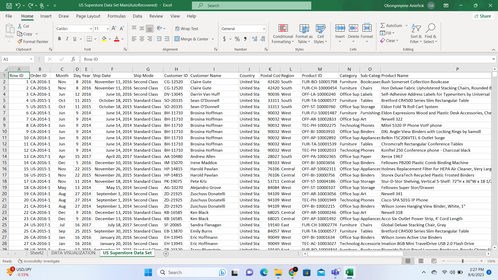

## Task Solutions
For the *highest Profit and Sale Generated*, I used the **MAX** function and inputted the profit cell range. This returned the highest profit generated in the sales data. i.e ==MAX(T2:T99995). I did this also for the maximum sales generated. i.e  =MAX(Q2:Q99995)

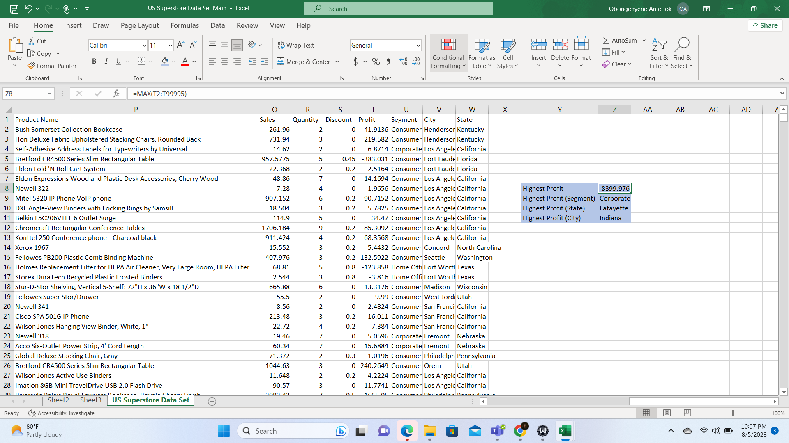
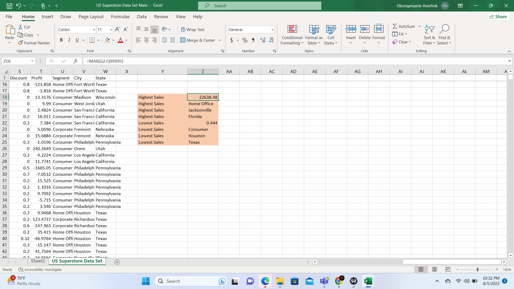
##
To answer the question, *"Highest Profit and Sales Recorded in Segment, State, and City”*, I first got the highest unit of goods sold using the **MAX** Function. Afterward, I got the highest unit sold (Segment) using **VLOOKUP** Function. I inputted the VLOOKUP Function first, followed by the formula I used to get the highest unit i.e, =MAX(T2:T99995) which serves as the lookup value, then the Segment cell range, the column index number, and lastly the range_lookup. i.e, =VLOOKUP(MAX(T2:T99995), T2:U99995,2, FALSE). I replicated this for the Stae and City, using the correct match for the cell range and column index for each of them during the replication. 

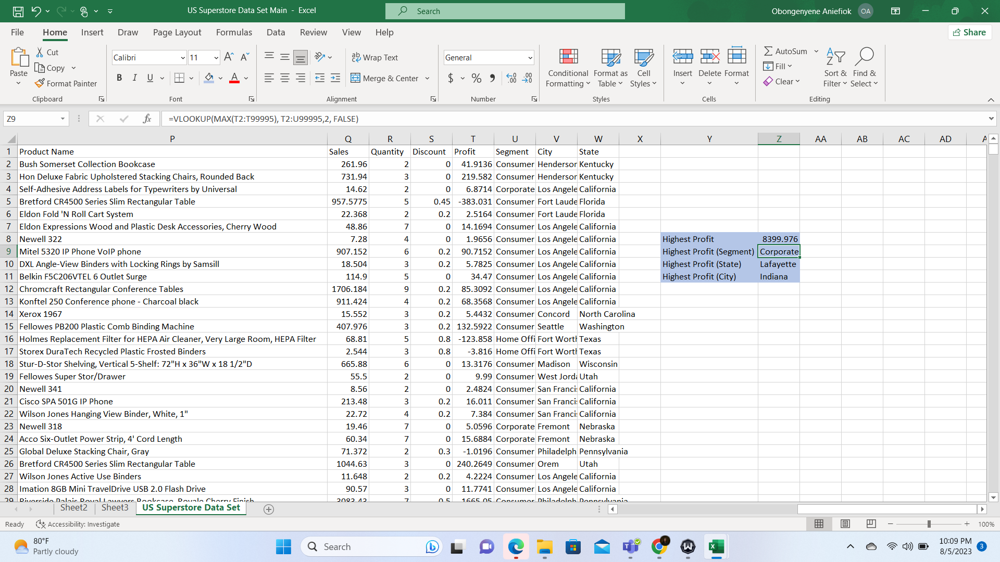

##
To get the *Sales Trend Across Years*, I first changed the date format to MDY, then using text to column, I separated the dates into days, months, and years. Afterward, I created a pivot table, then inputted the **Year** on the *“row field”* and then **Sales** criteria in the *"value"* field making sure that I changed the value field setting to sum so that we could get the sum of sales in the various years with in this case includes 2014, 2015, 2016 and 2017.

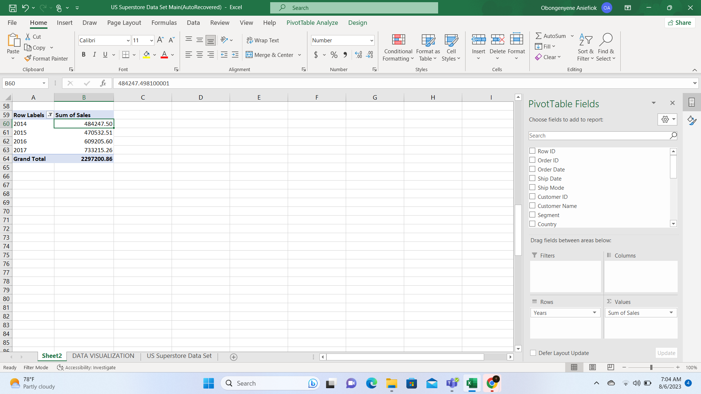
##
To get the *Top 10 States Recording the Highest Sales and Profit*, I created a pivot table, then inputted the **State** in the *“row field”* and the **Sales** criteria in the *“value field”* making sure that I changed the value field setting to **SUM** so that we can get the sum of sales. Afterward, I *Sorted* the data from the highest to lowest then *Filtered* the top 10 countries. I replicated the same thing to get the top 10 countries recording the highest profit.

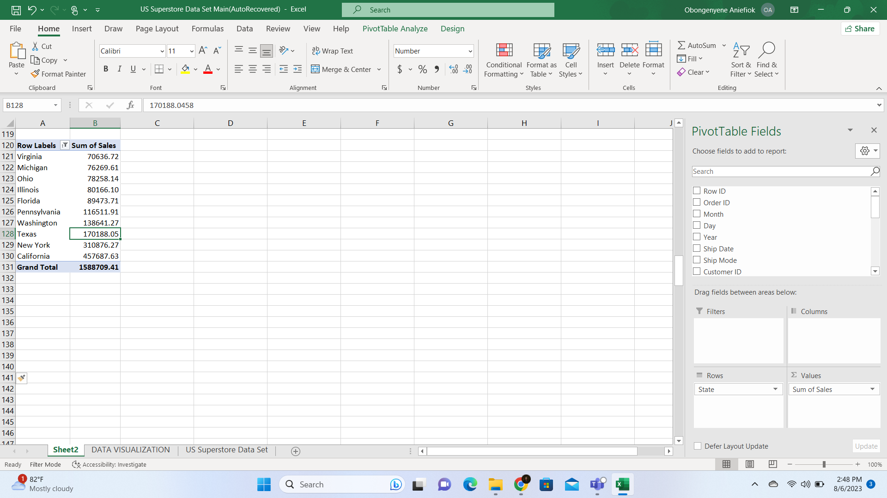
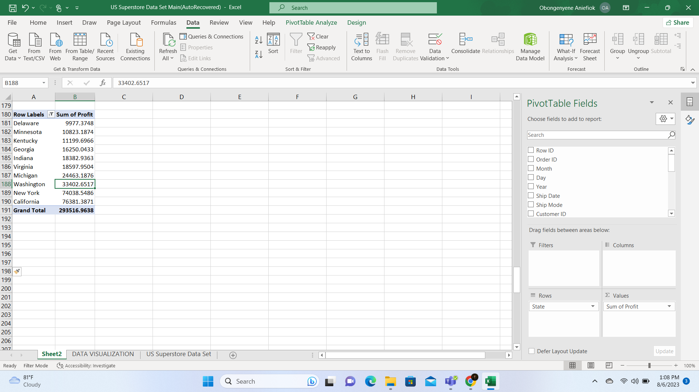
##
To get the *Most Preferred Shipping Mode by Customers*, I created a pivot table, then inputted the **Shipping mode** into the *“row field”* and *“value field”* making sure that I changed the value field setting to **Count** so that we can get the count of each shipping method which enables us to tell which shipping mode the customers preferred most.

##
To get the *Quantity of Products Sold in Each Product Category*, I again created a pivot table, then inputted the product **Category** into the *“row field”* and then the **Quantity** in the  *“value field”* making sure that I changed the value field setting to **Count** so that we can get the count of each category sold.
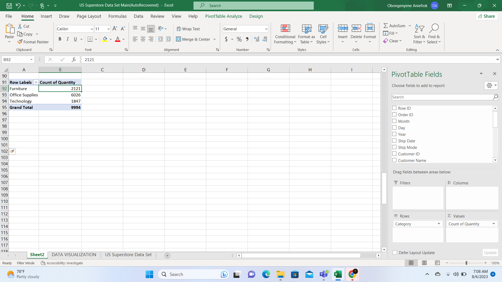
##

# Data Visualization
##
# Sales Trend

##
# Top 10 States in Profit and Sales
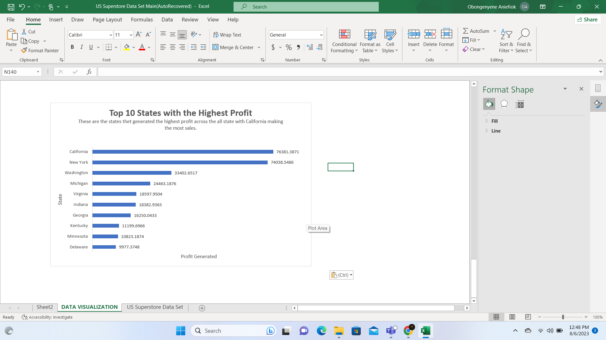
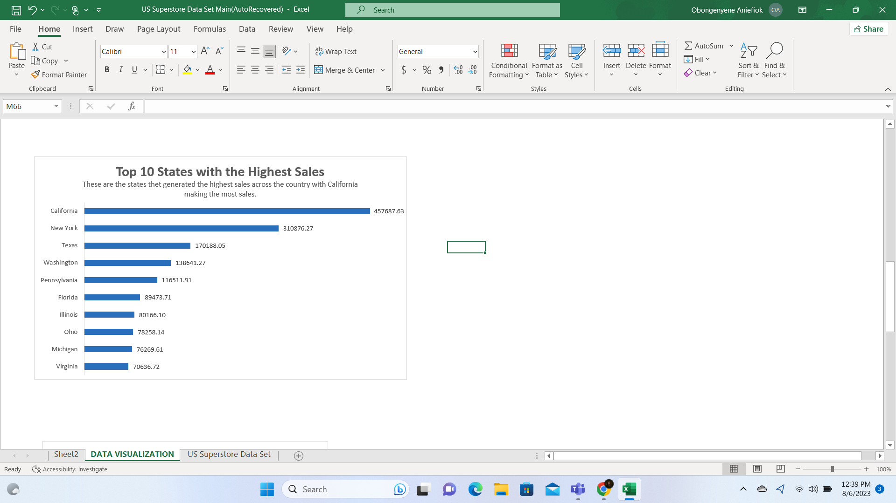
##
# Bottom 10 States in Sales
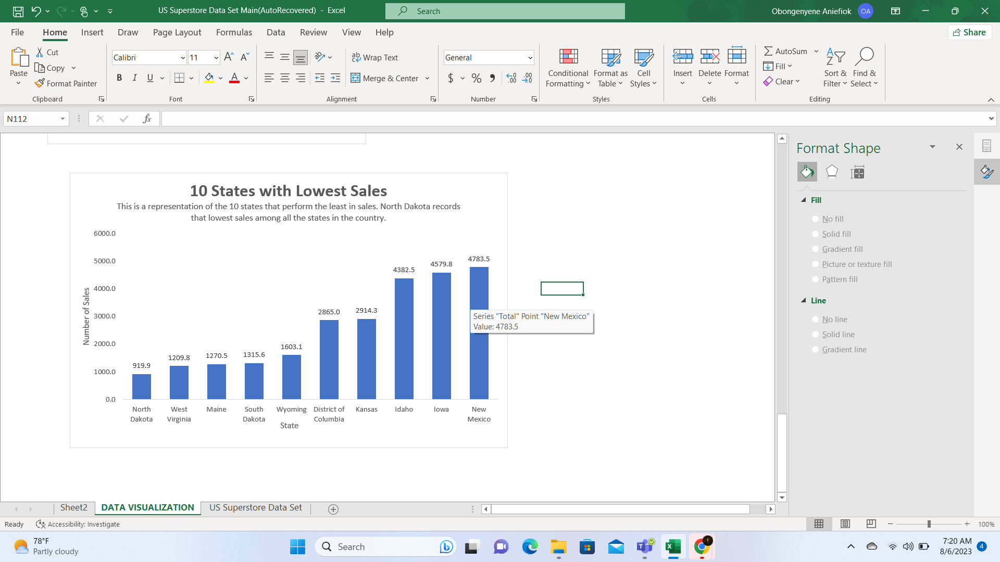

##
# Most Preferred Shipping Mode
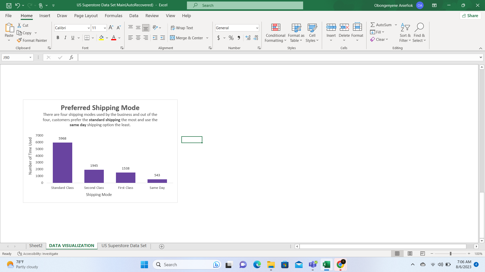
##
# Quantity of Products sold in Different Categories
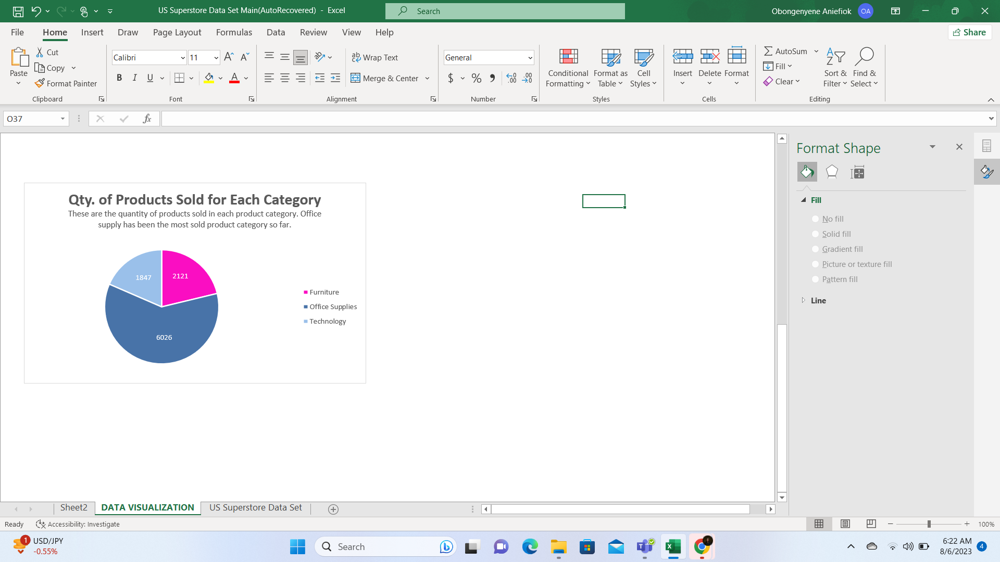

## Conclusion
The Excel lessons with our facilitator Promise Chinonso from *Basic Excel Functions*, to *Advance Excel Functions*, *Pivot Tables*, and *Data Visualization* have been very very impactful. The classes were very interactive and the lessons were easy to understand because of how she takes the time to break down the various Excel concepts. I look forward to the remaining classes. 

